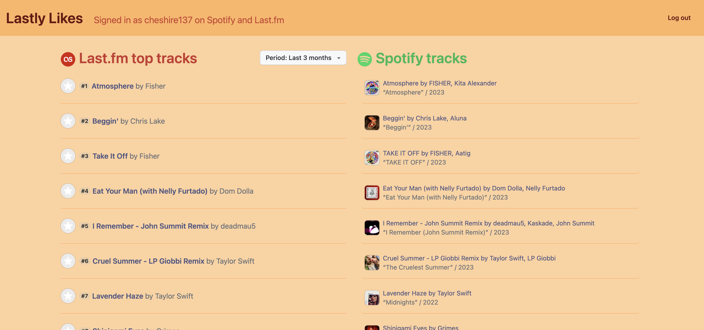

# Scrobble Saver

A web app that uses the [Last.fm API](https://www.last.fm/api) and the [Spotify API](https://developer.spotify.com/documentation/web-api) to like tracks on Spotify that are your top tracks on Last.fm.



## How to develop

Create a [Last.fm API app](https://www.last.fm/api/account/create). Set `http://localhost:8080/auth/lastfm` as the redirect URL.

Create a [Spotify API app](https://developer.spotify.com/dashboard/create). Set `http://localhost:8080/auth/spotify` as the redirect URL. Select the 'Web API' as the API your app will use.

### Backend

The backend is a Go server written using Go version 1.19.4.

```sh
cp config.yml.example config.yml
```

Add your Last.fm API key and secret to config.yml, as well as your Spotify client ID and client secret. Make sure the backend port matches the redirect URLs you set on Spotify and Last.fm. Come up with a new secret, such as from [randomkeygen.com](https://randomkeygen.com/) for "secret" in config.yml.

```sh
go run cmd/server/main.go
```

### Frontend

The UI is a React app using Vite.

```sh
cd ui
cp .env.example .env
```

Add your Last.fm API key to .env, as well as your Spotify client ID. Last.fm and Spotify secrets should _not_ be in .env.

```sh
npm install
npm run dev
```
